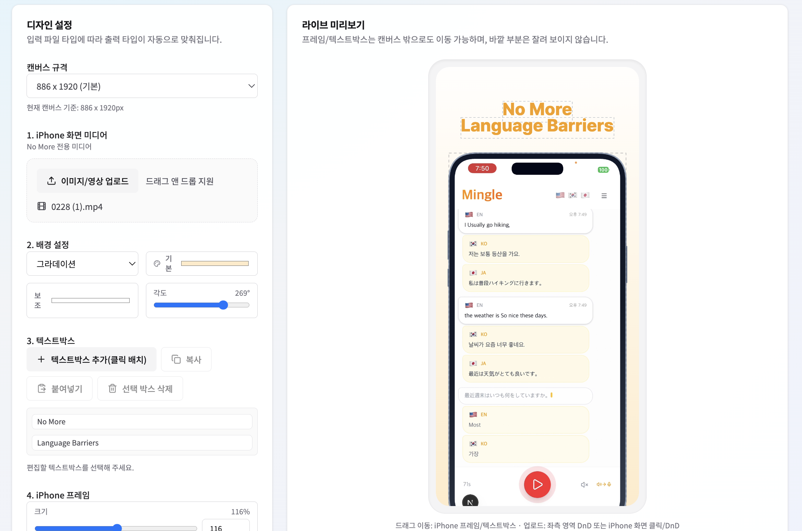
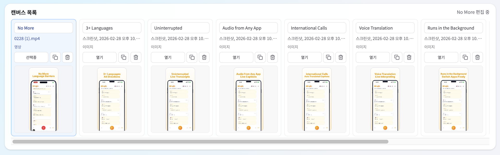

# App Store Preview Composer

## UI Screenshots




`appstore-preview` is a browser-based composer for iPhone App Store preview assets.
It is built with React + TypeScript + Tailwind + shadcn-style UI components, with an optional local API server for automation.

## i18n Automation API

This project now includes an optional local API server for i18n and batch automation.

Base URLs:
- Browser (recommended): `/api` (proxied by Vite dev server)
- `http://localhost:4318/api`

Run both Web + API (single command):

```bash
npm run dev
```

Recommended for local use:

```bash
npm run dev
```

Standalone API only:

```bash
npm run api:dev
```

Main endpoints:
- `GET /api/projects`
  - List all projects visible to the API (`.project-saves/*.appstore-preview-project.json`)
- `GET /api/projects/:projectId`
  - Read one project (`project` summary with `revision` + `state`)
- `GET /api/projects/full`
  - Full read dump for all local projects (`state` + `metas` + `rawFile`, each with `revision`)
- `POST /api/projects/:projectId/clone`
  - Clone an existing project (includes canvas media binaries stored by API)
- `POST /api/projects/:projectId/canvases/:canvasId/clone`
  - Clone one canvas into the same project or another project (`targetProjectId`)
- `PUT /api/projects/:projectId/canvases/:canvasId/media`
  - Upload/replace media binary for one canvas (`kind`, `name`, body=binary)
- `GET /api/projects/:projectId/canvases/:canvasId/media`
  - Download media binary for one canvas
- `GET /api/projects/:projectId/canvases/:canvasId/media/meta`
  - Read stored media metadata for one canvas
- `DELETE /api/projects/:projectId/canvases/:canvasId/media`
  - Delete stored media binary and clear canvas media state
- `DELETE /api/projects/:projectId`
  - Delete one project from API storage
- `GET /api/projects/:projectId/full`
  - Full read dump for one project (`state` + `metas` + `rawFile`)
- `PATCH /api/projects/:projectId/canvases/:canvasId/text-boxes/:textBoxId`
  - Update one text box (`text`, `width`, `fontSize`, `fontKey`, `color`, `x`, `y`)
  - Limits: `width` is clamped to `120..1200`, `fontSize` is clamped to `18..160`
- `PATCH /api/projects/:projectId/canvases/:canvasId/text-boxes/:textBoxId/position`
  - Move one text box position only (`x`, `y`)
- `PATCH /api/projects/:projectId/canvases/:canvasId/text-boxes`
  - Bulk update text boxes via `updates: [{ id, ...patch }]`
- `PATCH /api/projects/:projectId/canvases/:canvasId/phone`
  - Move/scale iPhone frame (`x`, `y`, `phoneScale` or `offset: { x, y }`)
- `GET /api/projects/:projectId/canvases/:canvasId/text-boxes/:textBoxId/meta`
  - Text box meta including wrapped lines and `lineCount`
- `GET /api/projects/:projectId/canvases/:canvasId/meta`
  - Full canvas shape meta (background, iPhone frame, all text boxes)
- `GET /api/projects/:projectId/meta`
  - Full project shape meta for all canvases
- `POST /api/projects/:projectId/export/zip`
  - Export ZIP with project JSON, per-canvas meta/state, i18n text map, preview PNG

Notes:
- ZIP export includes media references but does not embed original media binaries.
- API media binaries are stored under `.project-saves/media/<projectId>/<canvasId>/`.
- The API can import/operate on saved project payloads using `POST /api/projects/import`.
- `POST /api/projects/import` for an existing project should include `expectedRevision`.
  - If stale, API returns `409` with `code: "revision_conflict"` and `expectedRevision` / `actualRevision`.
- Text box constraints (API + GUI shared): `width 120..1200`, `fontSize 18..160`.
- When running `npm run dev`, the GUI auto-loads API projects on startup and auto-syncs project changes back to API.
- Project SoT is the API file storage (`.project-saves/*.appstore-preview-project.json`) for both GUI and API reads/writes.
- Legacy browser `localStorage` project data is used only for one-time migration to API storage, then no longer used as runtime state.
- For `full` read endpoints, query params are supported:
  - `includeMeta=true|false` (default: `true`)
  - `includeRawFile=true|false` (default: `true`)
  - `includeThumbnails=true|false` (default: `true`)

Quick read examples:

```bash
# list summaries
curl -s http://localhost:4318/api/projects

# read one project state
curl -s http://localhost:4318/api/projects/<projectId>

# read full dump for all projects (with meta + raw file)
curl -s "http://localhost:4318/api/projects/full?includeMeta=true&includeRawFile=true"

# read full dump for one project (skip raw file if not needed)
curl -s "http://localhost:4318/api/projects/<projectId>/full?includeMeta=true&includeRawFile=false"

# upload canvas media binary (image example)
curl -s -X PUT "http://localhost:4318/api/projects/<projectId>/canvases/<canvasId>/media?kind=image&name=shot-01.png" \
  -H "Content-Type: image/png" \
  --data-binary "@./shot-01.png"

# clone one canvas into another project (binary media included if stored by API)
curl -s -X POST "http://localhost:4318/api/projects/<sourceProjectId>/canvases/<sourceCanvasId>/clone" \
  -H "Content-Type: application/json" \
  -d '{"targetProjectId":"<targetProjectId>","name":"Shot Copy"}'

# move one text box
curl -s -X PATCH "http://localhost:4318/api/projects/<projectId>/canvases/<canvasId>/text-boxes/<textBoxId>/position" \
  -H "Content-Type: application/json" \
  -d '{"x":312,"y":260}'

# move/scale iPhone frame
curl -s -X PATCH "http://localhost:4318/api/projects/<projectId>/canvases/<canvasId>/phone" \
  -H "Content-Type: application/json" \
  -d '{"x":24,"y":-30,"phoneScale":1.08}'
```

## What This Project Is

- A visual editor for App Store-style iPhone preview images/videos
- A multi-project, multi-canvas workflow tool for marketing asset production
- A frontend-only app with local persistence and export support

## Features

- Multi-project workflow
- Multi-canvas per project (add, duplicate, rename, delete, reorder by drag and drop)
- iPhone screen media upload (image/video) via file picker or drag and drop
- Background styling (solid color or gradient with angle control)
- Draggable iPhone frame and text boxes, including center snap guides
- Text box editing:
  - On-canvas inline editing (double-click or Enter)
  - Font family, color, font size, and width controls
  - Numeric input + slider for size/width controls
- Export:
  - Single-canvas export (image input -> PNG, video input -> browser-supported video format)
  - Full-project ZIP export for all canvases
- Auto-save:
  - Project state in local browser storage
  - Optional file-based auto-save to a selected folder (`.project-saves/`)
- Undo/Redo:
  - Supports content and structural changes (including canvas/project delete/recover)
  - History is in-memory and resets after page refresh

## Canvas Presets

Includes `886x1920` plus additional iPhone-focused presets:

- `1260x2736`
- `1320x2868`
- `1290x2796`
- `1242x2688`
- `1284x2778`
- `1206x2622`
- `1179x2556`
- `1125x2436`
- `1080x2340`
- `1170x2532`

## Tech Stack

- React 19
- TypeScript
- Vite
- Tailwind CSS 4
- shadcn-style component setup
- JSZip (project ZIP export)

## Getting Started

```bash
npm install
npm run dev
```

Open the local URL shown by Vite in your browser.

## Scripts

```bash
npm run dev      # start development server
npm run build    # production build
npm run lint     # eslint
npm run preview  # preview production build
```

## Notes

- Video export format depends on browser `MediaRecorder` support.
- Project media files are stored in IndexedDB for restore across reloads.
